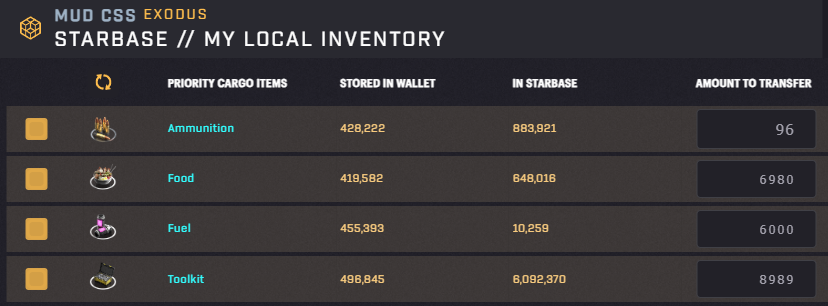
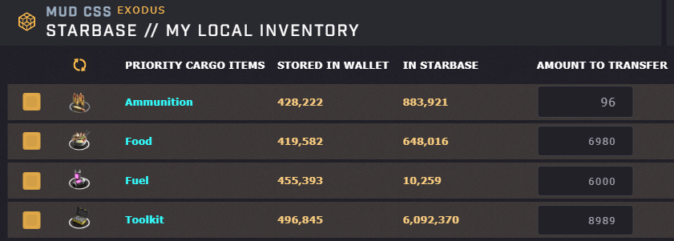

# SAGE Font Changer

## Overview
This script changes the font in Star Atlas SAGE to increase readability. 

This is a screenshot of inventory without any changes.

This is a screenshot with the script in normal mode. It changes the font in input fields to increase readability. Please note that input fields resize automatically depending on the number of digits and the script does not change this behavior. 

This is a screenshot with the script in aggressive mode. It changes the font of input fields like in normal mode, but it also changes the font for all text of a certain size. This can further increase readability, but might also break some layouts and might have some side-effects. Feel free to experiment with the settings. 

## Setup

1. Install Tampermonkey browser plugin - [Link](https://www.tampermonkey.net/)

2. Install the script in Tampermonkey - [Link](https://github.com/0xQuindar/sage-font-changer/raw/main/sage-font-changer-1.0.user.js)

3. Enjoy!

## Configuration
| Variable | Description |
| --- | --- |
| `configMode`            | In normal mode (default) only text in input fields is replaced. In aggressive mode normal text is also replaced. |
| `aggressiveMinFontSize` | Defines the minimum size of text the script looks for when in aggressive mode. |
| `aggressiveMaxFontSize` | Defines the maximum size of text the script looks for when in aggressive mode. |
| `newFontSize`           | Defines the new font size for all text changed in aggressive mode. |
| `newFontFamily`         | Defines the new font family for all text changed. | 

